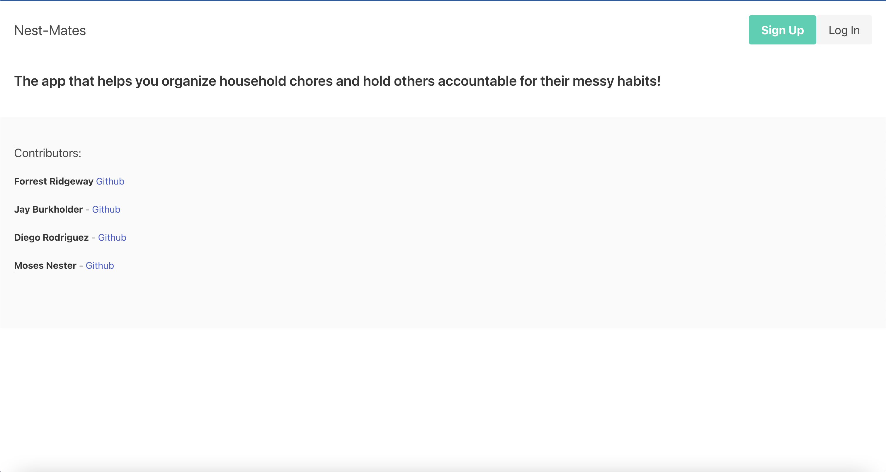

# Nest-mates

Nestmates is an app that helps roommates split tasks and chores evenly and fairly between each other, minimizing conflict. Users sign up to create a "nest" and invite their fellow "nestmates" to join. Users then create tasks to be assigned to everyone. Nestmates assigns tasks weekly to each nestmate fairly and evenly through round-robin assignment.

# Technology used

Handlebars
Bulma CSS framework
JavaScript

# Contributers

Moses Nester
Ben Ridgeway
Diego Rodriguez
Jay Burkholder
Taj Beteta

# Link

# Site View

